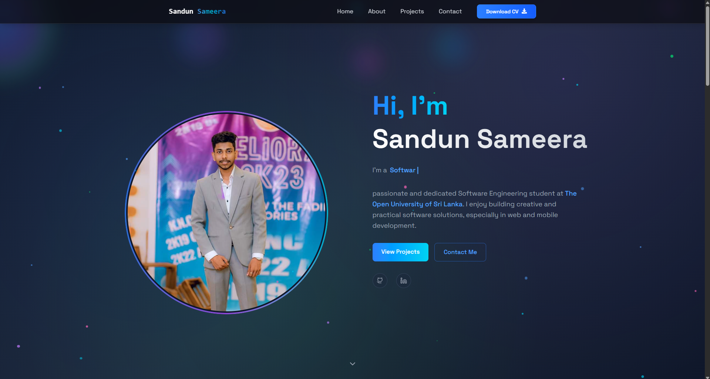

# sandun-portfolio

A clean, responsive personal portfolio website to showcase projects, skills, and contact details.

---

## 🔗 Live Demo

<!-- Replace with your deployed URL (e.g., GitHub Pages, Vercel, Netlify) -->
**URL:** https://sandunsameera.vercel.app  <!-- or https://your-site.vercel.app -->

---

## ✨ Features

- Mobile‑first, responsive layout
- Projects/Work section with cards
- Skills/Tech stack section
- About/Experience timeline
- Contact form (optional: EmailJS / Netlify Forms)
- Light/Dark theme toggle (optional)
- SEO‑ready meta tags and social preview image

---

## 🧰 Tech Stack

This portfolio is a static front‑end site. Use the option that matches your repo:

<details>
<summary><b>Option A — Plain HTML/CSS/JS</b></summary>

- HTML5, CSS3, JavaScript (no framework)
- Optional: CSS framework (TailwindCSS/Bootstrap), simple JS plugins
</details>

<details>
<summary><b>Option B — React (+ Vite)</b></summary>

- React 18
- Vite for fast dev/build
- Optional: TailwindCSS, React Router, EmailJS
</details>

---

## 📦 Project Structure (examples)

<details>
<summary><b>If Plain HTML/CSS/JS</b></summary>

```
sandun-portfolio/
├─ assets/
│  ├─ images/
│  └─ css/
│     └─ styles.css
├─ js/
│  └─ main.js
├─ index.html
└─ README.md
```
</details>

<details>
<summary><b>If React + Vite</b></summary>

```
sandun-portfolio/
├─ public/
│  └─ favicon.svg
├─ src/
│  ├─ components/
│  │  ├─ Header.jsx
│  │  ├─ ProjectCard.jsx
│  │  └─ Footer.jsx
│  ├─ sections/
│  │  ├─ Hero.jsx
│  │  ├─ Projects.jsx
│  │  └─ Contact.jsx
│  ├─ App.jsx
│  ├─ main.jsx
│  └─ styles/
│     └─ globals.css
├─ index.html
├─ package.json
├─ vite.config.js
└─ README.md
```
</details>

---

## 🚀 Getting Started (Local Development)

### 1) Clone

```bash
git clone https://github.com/sandun440/sandun-portfolio.git
cd sandun-portfolio
```

### 2) Run locally (choose one)

<details>
<summary><b>Plain HTML/CSS/JS</b></summary>

- Open `index.html` directly in a browser, **or**
- Use a simple local server (recommended):

```bash
# Python 3
python -m http.server 5173
# then visit http://localhost:5173
```

</details>

<details>
<summary><b>React + Vite</b></summary>

**Prerequisites:** Node.js ≥ 18

```bash
npm install
npm run dev
# Dev server starts (e.g., http://localhost:5173)
```

**Build for production:**

```bash
npm run build
npm run preview
```
</details>

---

## ⚙️ Configuration

- **Site metadata & SEO:** Update `<title>`, description, and Open Graph/Twitter meta tags in `index.html` (and `public/` if present).
- **Images:** Place hero/preview images in `assets/images/` (or `public/`). Update paths where used.
- **Contact form (optional):**
  - **EmailJS:** add your `service_id`, `template_id`, and `public_key` in the script/config.
  - **Netlify Forms:** add a form with `name` attribute and enable forms in site settings.

---

## 📤 Deployment

Choose one hosting option below.

<details>
<summary><b>GitHub Pages (static or React)</b></summary>

### Static site
1. Push the repo to GitHub.
2. Go to **Settings → Pages**.
3. Under **Source**, pick `Deploy from a branch`, select `main` and `/root` (or `/docs` if you build there).
4. Save and wait for deployment.

### React + Vite (gh-pages branch)
1. Install helper: `npm i -D gh-pages`.
2. In `package.json`, add:
   ```json
   {
     "homepage": "https://<your-username>.github.io/sandun-portfolio",
     "scripts": {
       "predeploy": "npm run build",
       "deploy": "gh-pages -d dist"
     }
   }
   ```
3. If your repo is **not** a user/organization site, set the `base` in `vite.config.js`:
   ```js
   export default defineConfig({
     base: '/sandun-portfolio/',
     // ...
   })
   ```
4. Deploy: `npm run deploy`.
</details>

<details>
<summary><b>Vercel / Netlify</b></summary>

- **Vercel:** Import the repo → framework: Vite/React or “Other” → build: `npm run build` → output: `dist`
- **Netlify:** New site from Git → build: `npm run build` → publish directory: `dist`
</details>

---

## 📸 Screenshots



---

## 🙌 Contributing

Pull requests are welcome. For major changes, please open an issue first to discuss what you would like to change.

1. Fork the project
2. Create your feature branch: `git checkout -b feature/amazing-feature`
3. Commit your changes: `git commit -m "feat: add amazing feature"`
4. Push to the branch: `git push origin feature/amazing-feature`
5. Open a Pull Request

---
## 👤 Author

**Sandun Sameera** — [@sandun440](https://github.com/sandun440)

If you use this template, ⭐ the repo and share your portfolio!
